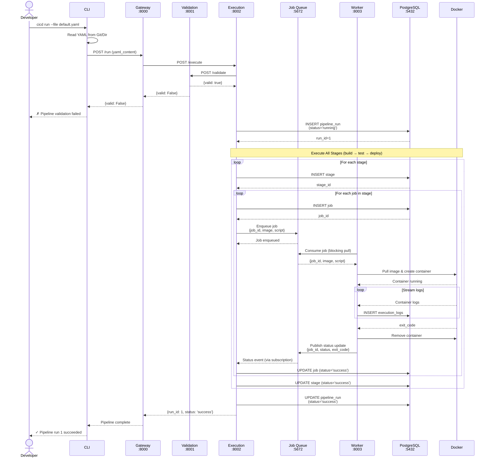

# Sequence Design for Pipeline Execution

## Workflow Overview

This diagram illustrates the complete execution flow of a CI/CD pipeline run, from user initiation to completion.

### Key Workflow Phases

1. **Pipeline Submission** (Steps 1-3)
    - Developer runs `cicd run` command via CLI
    - CLI reads pipeline YAML configuration from Git repository or local directory
    - CLI sends pipeline definition to API Gateway

2. **Validation** (Steps 4-7)
    - Gateway forwards request to Execution Service
    - Execution Service validates pipeline configuration via Validation Service
    - If validation fails, error is returned immediately to the user
    - If validation succeeds, pipeline execution begins

3. **Pipeline Initialization** (Steps 8-9)
    - Execution Service creates a new pipeline run record in PostgreSQL
    - Database returns a unique `run_id` for tracking

4. **Job Dispatch and Execution** (Steps 10-23, looped per stage/job)
    - For each stage in the pipeline (e.g., build → test → deploy):
        - Execution Service creates stage and job records in the database
        - Jobs are enqueued to the Job Queue (Redis/RabbitMQ) with execution details
        - Worker Service consumes jobs from the queue asynchronously
        - Worker pulls Docker image and creates container for job execution
        - Container logs are streamed and stored in PostgreSQL
        - Worker publishes job completion status back to the queue
        - Execution Service receives status updates via queue subscription and updates database

5. **Pipeline Completion** (Steps 24-27)
    - After all stages complete, Execution Service marks pipeline run as successful
    - Success status is propagated back through Gateway to CLI
    - Developer receives confirmation of successful pipeline execution

### Key Design Features

- **Asynchronous Processing**: Job Queue decouples job dispatch from execution, allowing Workers to process jobs at their own pace
- **Horizontal Scalability**: Multiple Worker instances can consume from the same queue for parallel job execution
- **State Persistence**: All execution state (runs, stages, jobs, logs) is persisted in PostgreSQL for auditing and reporting
- **Event-Driven Updates**: Status changes flow through the queue as events, enabling loose coupling between services