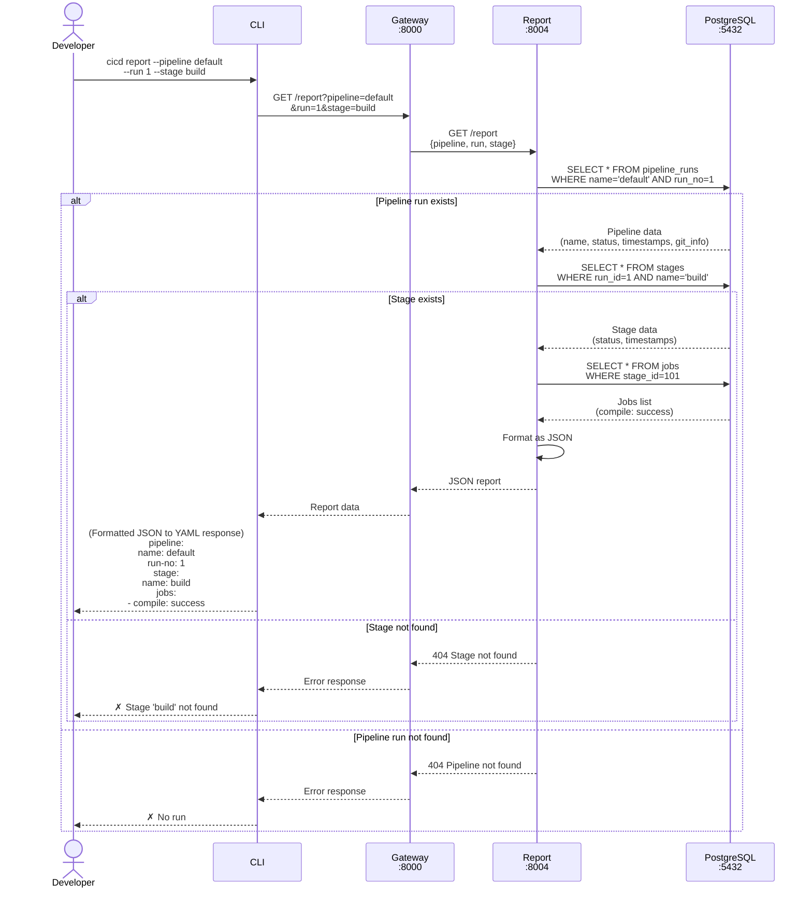

# CI/CD System — Reporting Sequence Diagram

## Workflow Overview

This diagram illustrates how users query pipeline execution results through the reporting system. The Reporting Service aggregates data from PostgreSQL and returns formatted results based on user-specified filters.

### Key Workflow Phases

1. **Report Request** (Steps 1-3)
    - Developer runs `cicd report` command with filters (pipeline name, run number, stage name)
    - CLI constructs query parameters and sends GET request to API Gateway
    - Gateway routes the request to Reporting Service

2. **Pipeline Run Lookup** (Steps 4-5)
    - Reporting Service queries PostgreSQL for the specified pipeline run
    - Two possible outcomes:
        - **Run exists**: Proceed to stage lookup
        - **Run not found**: Return 404 error immediately

3. **Stage Lookup** (Steps 6-7, if pipeline run exists)
    - Reporting Service queries for the specified stage within the pipeline run
    - Two possible outcomes:
        - **Stage exists**: Proceed to job aggregation
        - **Stage not found**: Return 404 error

4. **Job Aggregation** (Steps 8-9, if stage exists)
    - Reporting Service fetches all jobs belonging to the stage
    - Database returns job details including name and execution status

5. **Response Formatting** (Steps 10-13)
    - Reporting Service formats aggregated data as JSON
    - Response flows back through Gateway to CLI
    - CLI converts JSON to human-readable YAML format
    - Developer sees structured report of pipeline execution results

### Query Flexibility

The Reporting Service supports various query patterns:

- **Full pipeline report**: `cicd report --pipeline default --run 1` (returns all stages and jobs)
- **Stage-specific report**: `cicd report --pipeline default --run 1 --stage build` (returns jobs in 'build' stage)
- **Latest run**: `cicd report --pipeline default` (omit run number to get most recent execution)