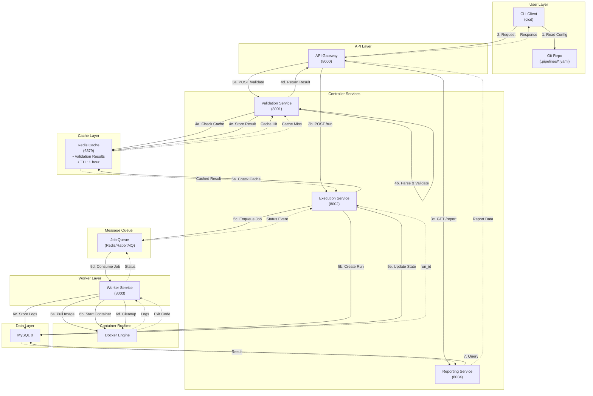
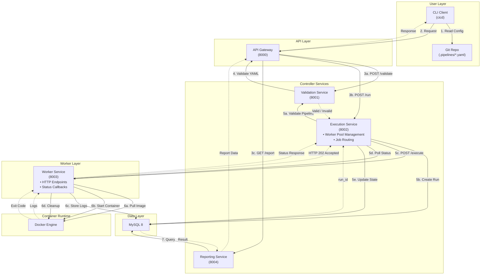

# CI/CD System — Design Alternatives

This document discusses alternative architectural designs that were considered during the design phase and the rationale for not selecting them.

---

## Alternative 1: Redis Cache for Validation Results

### Description

This alternative introduces a Redis cache layer between the Validation Service and other components to store validation results. The goal is to avoid redundant validation of identical pipeline configurations.

#### Architecture Diagram

### Pros and Cons

#### Pros

1. **Reduced Validation Overhead**
    - Identical pipeline configurations are validated only once
    - Subsequent requests with the same YAML content return cached results instantly
    - Reduces CPU usage on Validation Service for repeated validations

2. **Improved Response Time**
    - Cache lookups are significantly faster than full YAML parsing and validation
    - Better user experience for repeated pipeline runs with unchanged configurations

3. **Scalability for High-Frequency Validations**
    - Multiple Execution Service instances can share cached validation results
    - Reduces load on Validation Service during traffic spikes

#### Cons

1. **Increased Infrastructure Complexity**
    - Requires deploying and maintaining an additional Redis instance
    - Need to configure cache eviction policies, memory limits, and persistence settings
    - Adds another potential point of failure in the system

2. **Cache Invalidation Challenges**
    - Determining appropriate TTL (time-to-live) is difficult
    - Risk of serving stale validation results if validation logic changes
    - No clear mechanism to invalidate cache when validation rules are updated

3. **Minimal Performance Gain for Target Use Case**
    - CI/CD pipelines typically change frequently during development
    - Cache hit rate would be low in practice (developers modify YAMLs between runs)
    - Validation is already fast (YAML parsing + schema validation < 100ms)

4. **Additional Operational Overhead**
    - Need to monitor cache hit rates, memory usage, and eviction patterns
    - Requires backup/restore strategy if cache persistence is needed
    - Debugging becomes harder when cached results differ from fresh validations

5. **Unnecessary for Project Scope**
    - Validation Service is not a bottleneck in the current design
    - Premature optimization without evidence of performance issues
    - Adds complexity without clear benefit for a course project demonstrating core concepts

### Reason for Rejection

The team decided **not to select this design** because:

1. **Over-engineering for limited benefit**: The validation process (YAML parsing + schema validation + cycle detection) is already fast enough that caching provides negligible performance improvement. Our target use case involves developers iterating on pipeline definitions, meaning cache hit rates would be very low.

2. **Operational complexity outweighs gains**: Adding Redis introduces deployment complexity, monitoring requirements, and potential failure modes. For a course project focused on demonstrating CI/CD orchestration and distributed systems concepts, managing cache invalidation and TTL policies distracts from core learning objectives.

3. **Validation is not a bottleneck**: Performance profiling and estimation suggest validation takes <100ms per request. The actual bottleneck in CI/CD systems is job execution time (minutes), not validation overhead (milliseconds). Optimizing a non-bottleneck violates the principle of targeted optimization.

4. **Cache invalidation is unsolved**: There's no clean way to invalidate cached results when validation logic changes (e.g., adding new schema rules, updating cycle detection algorithms). This could lead to subtle bugs where cached "valid" results are actually invalid under new rules.

**Conclusion**: While Redis caching is a valuable pattern for read-heavy workloads with stable data, it's unnecessary complexity for pipeline validation in this project. The selected design keeps infrastructure simpler without sacrificing meaningful performance.

---

## Alternative 2: Direct Execution-Worker Coupling (No Message Queue)

### Description

This alternative uses direct HTTP/gRPC communication between the Execution Service and Worker Service, eliminating the message queue component. The Execution Service synchronously dispatches jobs to Workers and receives status updates via polling or webhooks.

#### Architecture Diagram

### Pros and Cons

#### Pros

1. **Simpler Infrastructure**
    - No message queue to deploy, configure, or monitor
    - Fewer components means less operational overhead
    - Reduces network hops and infrastructure costs

2. **Easier Development and Debugging**
    - Direct request-response makes it easier to trace execution flow
    - No need to understand message queue semantics (acknowledgments, prefetch, dead-letter queues)
    - Simpler local development setup (just start services, no queue broker)

#### Cons

1. **Tight Coupling Between Services**
    - Execution Service must know Worker Service endpoints and maintain a worker registry
    - Harder to replace or upgrade Workers independently

2. **Poor Scalability and Load Distribution**
    - No built-in mechanism for distributing jobs across multiple Workers
    - Workers cannot self-register or auto-scale without additional service discovery

3. **Fragile Failure Handling**
    - If a Worker crashes mid-job, Execution Service must detect timeout and retry
    - No natural retry mechanism; requires custom implementation
    - Failed jobs may be lost if Execution Service restarts before retry
    - Status polling is chatty and inefficient

4. **Synchronous Blocking Issues**
    - Cannot efficiently handle long-running jobs without async patterns
    - Risk of cascading failures if Workers become slow or unresponsive

5. **No Natural Backpressure Mechanism**
    - Workers can be overwhelmed if Execution Service dispatches jobs faster than they can process
    - Hard to implement fair scheduling across multiple pipelines

### Reason for Rejection

The team decided **not to select this design** because:

1. **Scalability limitations**: Direct coupling makes it difficult to horizontally scale Workers. The Execution Service would need to implement custom load balancing, health checking, and worker pool management—essentially reinventing features that message queues provide out-of-the-box. This violates the "don't reinvent the wheel" principle.

2. **Fragile under failures**: Without a message queue, job retry logic must be custom-built in the Execution Service. If the Execution Service crashes after dispatching a job but before recording the result, the job state is lost. Message queues provide durability and automatic retry mechanisms that make the system more resilient.

3. **Operational complexity shifts to code**: While removing the queue simplifies infrastructure, it pushes complexity into the Execution Service codebase (worker registry, health checks, custom retry logic, status polling). This makes the code harder to maintain and more bug-prone compared to leveraging a mature message queue library.

4. **Limited parallelism**: With synchronous communication, the Execution Service can only dispatch as many jobs as it has available threads/connections. A message queue allows multiple Workers to consume jobs concurrently without coordination overhead, enabling true parallel execution.

**Conclusion**: While direct coupling reduces infrastructure complexity, it sacrifices scalability, resilience, and alignment with industry best practices. The message queue design provides better failure handling, natural load distribution, and demonstrates key distributed systems concepts that are core learning objectives for this course project. The operational overhead of running a message queue is justified by the architectural benefits it provides.

---

## Summary

Both alternatives were carefully considered but ultimately rejected in favor of the selected design:

- **Alternative 1 (Redis Cache)**: Over-engineers a non-bottleneck, adding operational complexity without meaningful performance gains for the target use case.
- **Alternative 2 (No Queue)**: Simplifies infrastructure but sacrifices scalability, resilience, and learning value by tightly coupling services.

The selected design with a message queue (but without validation caching) strikes the right balance between operational simplicity and architectural soundness for a graduate-level distributed systems course project.
