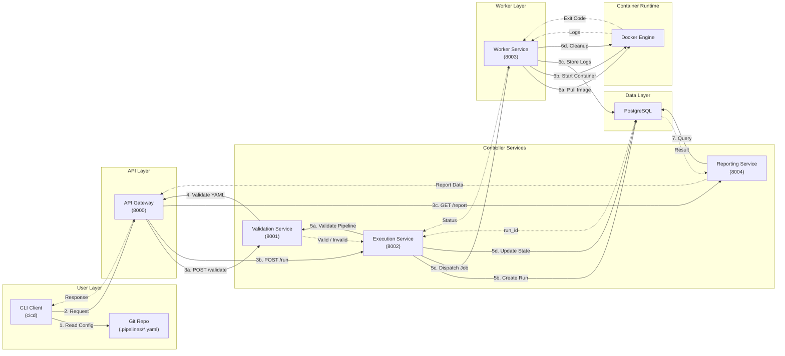

# CI/CD System — High-Level Design

## Architecture Overview

This CI/CD system follows a microservices architecture with clear separation of concerns across six layers: User Interface, API Gateway, Controller Services, Worker Layer, Data Layer, and Container Runtime.

## Design Summary

The system adopts a **service-oriented architecture** where:

- **CLI client** reads pipeline definitions from Git repositories and communicates with the backend through an API Gateway
- **API Gateway** (port 8000) routes requests to specialized services using REST/gRPC
- **Controller layer** contains three independent services:
    - Validation Service (port 8001): YAML parsing, schema validation, and cycle detection
    - Execution Service (port 8002): Pipeline orchestration, job scheduling, and state management
    - Reporting Service (port 8004): Query aggregation and result formatting
- **Worker Service** (port 8003) manages job execution through Docker containers, and collecting logs
- **PostgreSQL database** (port 5432) persists pipeline runs, stages, jobs, and execution logs
- **Docker Engine** handles container lifecycle and image management

## Pros and Cons

### Pros

1. **Clear Separation of Concerns**
    - Each service has a well-defined responsibility, making the codebase easier to maintain and test
    - Validation logic is decoupled from execution, allowing independent development and updates

2. **Scalability**
    - Microservices architecture allows horizontal scaling of individual components
    - Worker service can be scaled independently to handle varying workload demands
    - Multiple worker instances can process jobs in parallel

3. **Flexibility and Extensibility**
    - Easy to add new services (e.g., notification service, metrics service) without affecting existing ones
    - Can support multiple protocols (REST/gRPC) through the API Gateway
    - Worker service can support different container runtimes with minimal changes

4. **Fault Isolation**
    - Failure in one service (e.g., reporting) doesn't bring down the entire system
    - Worker failures are contained and don't affect the controller services

5. **Technology Independence**
    - Each service can be implemented in different languages/frameworks if needed
    - Database and cache layers can be swapped without major architectural changes

6. **Clean API Design**
    - API Gateway provides a single entry point, simplifying client implementation
    - Service-to-service communication is explicit and traceable

### Cons

1. **Increased Complexity**
    - Multiple services require more deployment and monitoring infrastructure
    - Service discovery, inter-service communication, and network configuration add complexity
    - More moving parts increase the potential for configuration errors

2. **Network Overhead**
    - Inter-service communication introduces latency compared to monolithic design
    - Each hop (CLI → Gateway → Service → Database) adds network round-trip time

3. **Execution/Worker Coupling Risk**
    - Direct HTTP/gRPC calls between Execution Service and Worker Service create tight coupling
    - Without a message queue or event bus, job dispatch becomes synchronous and chatty
    - Status updates require frequent polling or webhooks, increasing network traffic
    - Harder to implement retry logic and failure recovery (e.g., if Worker crashes mid-job)
    - Difficult to handle backpressure when Workers are overloaded

4. **Database as Log Sink Limitations**
    - Storing raw execution logs directly in PostgreSQL can cause table bloat over time
    - Large log volumes can degrade query performance for pipeline status checks
    - Competing workload: transactional queries (pipeline status) vs. append-heavy log writes
    - May require eventual migration to dedicated log storage (e.g., S3, Elasticsearch)

## Design Rationale

This architecture was chosen for the following reasons:

1. **Educational Value**: The microservices approach provides hands-on experience with distributed systems concepts, which aligns with the course objectives around container orchestration and service communication.

2. **Industry Relevance**: Modern CI/CD platforms (Jenkins X, GitLab CI, GitHub Actions) use similar distributed architectures, making this design representative of production systems.

3. **Clear Learning Boundaries**: Each service represents a distinct domain (validation, execution, reporting), making it easier to understand, implement, and demonstrate specific functionality.

4. **Demonstration of Container Orchestration**: The separation between controller and worker layers showcases container management patterns similar to Kubernetes' control plane and worker node architecture.

5. **Incremental Development**: Services can be implemented and tested independently, allowing for iterative development and easier debugging during the project timeline.

6. **Realistic Scaling Scenarios**: The design naturally supports demonstrating horizontal scaling concepts, particularly with the Worker Service handling parallel job execution.

7. **API Gateway Pattern**: Including an API Gateway demonstrates understanding of modern cloud-native architectures and provides a clean interface for future extensions (webhooks, UI, multiple clients).
