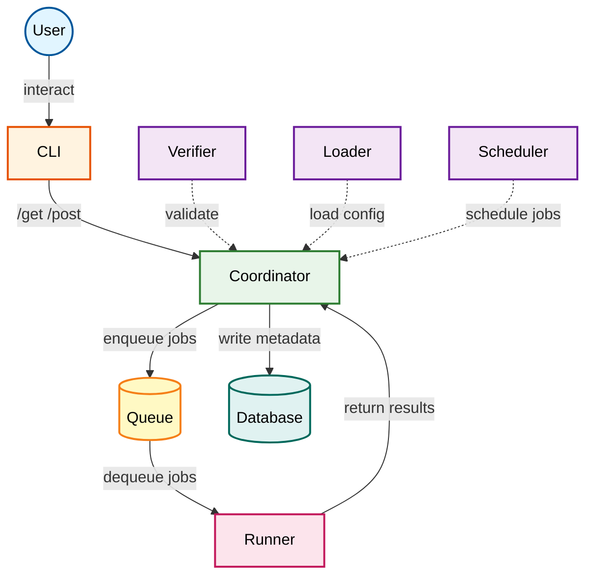

# CI/CD High-Level Architecture

## Overview
This document describes the architecture of our custom CI/CD system.

## System Diagram

## Components

- **CLI**: Command-line interface for user interaction
- **Coordinator/Control System**: Central server managing job lifecycle
- **Verifier**: Validates configuration files
- **Loader**: Loads and parses YAML configurations
- **Scheduler**: Schedules jobs for execution
- **Queue**: Message queue for decoupling job submission from execution, allowing asynchronous job distribution to runners
- **Database**: Persists job metadata and results
- **Runner**: Executes jobs in Docker containers

## Data Flow

1. **User invokes CLI commands**: User runs commands like `cicd run`, `cicd dry-run`, or `cicd validate`
2. **CLI makes HTTP requests**: CLI translates user commands into HTTP GET/POST requests to the Coordinator server
3. **Coordinator processes requests**:
   - **Verifier** validates the YAML configuration
   - **Loader** parses and loads the configuration
   - **Scheduler** determines job execution order and resource allocation
4. **Metadata persistence**: Coordinator writes job metadata to Database (status: pending, configuration, timestamps, etc.)
5. **Job enqueuing**: Coordinator enqueues jobs to RabbitMQ message queue with execution details (Docker image, script, location, metadata)
6. **Job distribution**: Runner(s) dequeue jobs from the queue when ready to execute
7. **Job execution**: Runner executes the job in an isolated Docker container
8. **Result collection**: Runner returns execution results to Coordinator (status, timestamps, exit code, logs)
9. **Result persistence**: Coordinator updates job status and results in Database
10. **Response to user**: CLI retrieves and displays job results and status to the user